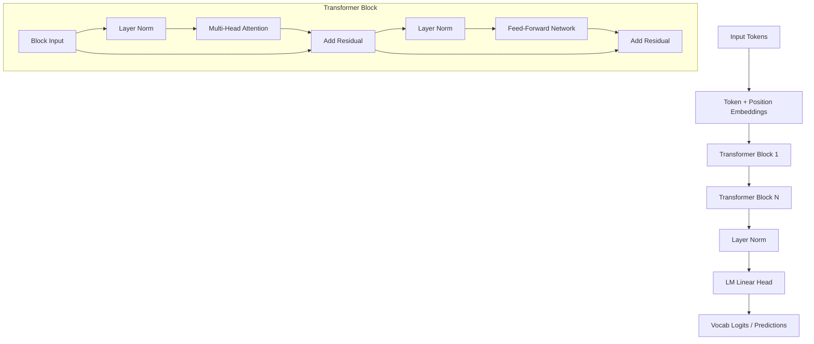

# 🚀 Learning NLP & LLMs: From Foundations to Fine-Tuning

Welcome to your hands-on learning journey into Natural Language Processing (NLP) and Large Language Models (LLMs)! This repository is a step-by-step, self-contained educational playground designed to take a beginner from the historical roots of sequential modeling to building and fine-tuning a custom Transformer LLM from scratch.

Every script is written in **PyTorch**, organized into independent folders, and features extensive inline explanations, tensor shape tracking, and runnable training tasks.

---

## 📂 Learning Map & Directory Structure

Each directory contains a self-contained tutorial script. You can run them independently:

```bash
Fine_tuning_Modelfroscratch/
├── 0_PyTorch_Basics/
│   └── pytorch_cheat_sheet.py   # Master PyTorch basics (tensors, shapes, autograd, custom layers)
├── 0_TensorFlow_Basics/
│   └── tensorflow_cheat_sheet.py # Master TensorFlow basics (constants, variables, GradientTape, custom layers)
├── 1_Foundations_RNN_LSTM_GRU/
│   ├── vanilla_rnn.py           # Vanilla RNN cell implementation and training
│   ├── lstm.py                  # LSTM cell implementation, gates, and training
│   ├── gru.py                   # GRU cell implementation and training
│   └── compare.py               # Shared comparative benchmark runner
├── 2_Transformer_From_Scratch/
│   └── transformer_from_scratch.py  # Building a complete Decoder-Only MiniGPT from scratch
├── 3_Finetuning_Tutorial/
│   ├── full_finetuning.py       # Full Fine-Tuning: updates 100% of weights
│   ├── freeze_finetuning.py     # PEFT Type 1: Freeze backbone, train final head (1.5% weights)
│   ├── lora_finetuning.py       # PEFT Type 2: LoRA implemented from scratch in PyTorch (1.9% weights)
│   ├── qlora_finetuning.py      # PEFT Type 3: QLoRA implemented from scratch (8-bit quantized weights)
│   └── compare.py               # Comprehensive comparative benchmark runner
└── 4_Vision_Models/
    ├── resnet_from_scratch.py   # Building a Mini-ResNet from scratch & training on shape images
    └── gan_from_scratch.py      # Building a Generative Adversarial Network (GAN) from scratch
```

---

## 🏛️ Module 1: Sequential NLP Foundations (RNN, LSTM, GRU)

Before Transformers took over the world, NLP relied on networks that processed text **word-by-word (or character-by-character) in a sequence**.

```
Input:   l  --->  e  --->  a  --->  r  --->  n
         │        │        │        │        │
State:  h0 ───>  h1 ───>  h2 ───>  h3 ───>  h4
```

### 1. Vanilla RNN (Recurrent Neural Network)
*   **How it works:** It maintains a hidden state $h_t$ that acts as its memory, updating it at each step:
    $$h_t = \tanh(W_{hh} h_{t-1} + W_{xh} x_t + b_h)$$
*   **The Problem:** **Vanishing Gradients.** Because the weights are multiplied repeatedly over long sequences, gradients shrink to zero during backpropagation, making the model "forget" early words in a long sentence.

### 2. LSTM (Long Short-Term Memory)
To fix vanishing gradients, LSTMs introduced a **Cell State ($c_t$)** that acts like a direct high-speed highway, allowing information to flow unchanged. It uses three gates:
*   **Forget Gate ($f_t$):** Decides what to throw away from memory.
*   **Input Gate ($i_t$):** Decides what new information to store in the cell state.
*   **Output Gate ($o_t$):** Decides what part of the cell state to output to the hidden state ($h_t$).

### 3. GRU (Gated Recurrent Unit)
A streamlined, faster version of the LSTM that merges the cell state and hidden state, using only two gates:
*   **Reset Gate ($r_t$):** Controls how much past information to forget.
*   **Update Gate ($z_t$):** Decides how much of the past state to keep.

#### 🚀 Running Module 1
You can run any of the individual models independently:
```bash
python3 1_Foundations_RNN_LSTM_GRU/vanilla_rnn.py
python3 1_Foundations_RNN_LSTM_GRU/lstm.py
python3 1_Foundations_RNN_LSTM_GRU/gru.py
```
Or run the comparative benchmark to train and compare them side-by-side:
```bash
python3 1_Foundations_RNN_LSTM_GRU/compare.py
```

---

## 🧠 Module 2: The Transformer LLM from Scratch

Transformers revolutionized AI because they process **all tokens in a sequence simultaneously (in parallel)** instead of step-by-step. They do this using **Self-Attention**.

### 🔍 Understanding Q, K, and V (Self-Attention Analogy)
Think of Self-Attention like search:
*   **Query ($Q$):** What you are looking for (e.g., a search term).
*   **Key ($K$):** The labels/titles of all items in the database (e.g., YouTube video titles).
*   **Value ($V$):** The actual content of those items (e.g., the YouTube video contents).

We multiply Query and Key ($Q \times K^T$) to see how well they match. We scale the result, apply softmax to get matching percentages (attention weights), and multiply by $V$ to extract the relevant content:
$$\text{Attention}(Q, K, V) = \text{softmax}\left(\frac{QK^T}{\sqrt{d_k}}\right)V$$

### 🛡️ Causal Masking (Decoder)
In a text generator, a model must not be allowed to "look into the future." We apply a **Causal Mask**—a lower triangular matrix of $-\infty$ in the attention scores—so that when predicting the next token, the model can only attend to past tokens.

```
Causal Mask Matrix:
[ 1  0  0 ]   (Token 1 can only look at Token 1)
[ 1  1  0 ]   (Token 2 can look at Token 1 and 2)
[ 1  1  1 ]   (Token 3 can look at Token 1, 2, and 3)
```

### 🏗️ Pre-LN Transformer Architecture
Our custom `MiniGPT` model stacks blocks designed like this:


#### 🚀 Running Module 2
Navigate to the directory and run:
```bash
python3 2_Transformer_From_Scratch/transformer_from_scratch.py
```
*Watch MiniGPT learn the spelling, grammar, and rhythm of a classic nursery rhyme, and generate text under different temperatures (low temperature = focused, high temperature = creative).*

---

## 🛠️ Module 3: Demystifying Fine-Tuning & PEFT

What is the difference between Pre-training and Fine-tuning?
*   **Pre-Training (Expensive):** Training a model from scratch on billions of pages of text so it learns grammar, facts, and structure.
*   **Fine-Tuning (Cheap):** Taking a pre-trained model and training it further on a small, high-quality dataset to teach it a specific task, tone, or format.

### ❄️ Parameter-Efficient Fine-Tuning (PEFT)
Instead of updating all millions of parameters (Full Fine-Tuning), we can **freeze** the bulk of the model (pre-trained backbone) and only train a tiny fraction of the weights (like the final classification head). 

In `finetuning_tutorial.py`, we:
1. Train a model on **General Facts** (represents a base model).
2. Test it, proving it doesn't know Q&A or pirate speak.
3. **Freeze the Transformer blocks** and only train the final output layer (updates only **4.3%** of the weights!).
4. Test it again, showing it perfectly answers questions in pirate-speak!

#### 🚀 Running Module 3
You can run any of the fine-tuning methods independently:
```bash
python3 3_Finetuning_Tutorial/full_finetuning.py
python3 3_Finetuning_Tutorial/freeze_finetuning.py
python3 3_Finetuning_Tutorial/lora_finetuning.py
python3 3_Finetuning_Tutorial/qlora_finetuning.py
```
Or run the comparative benchmark to train and compare them all side-by-side:
```bash
python3 3_Finetuning_Tutorial/compare.py
```

---

## 🎨 Module 4: Computer Vision Foundations & Generative Models

While text models process 1D sequences, **Vision Models** process 2D/3D grids of pixels representing spatial images.

### 1. Classical CNN Architectures
*   **VGG (Visual Geometry Group):** Introduced the simplicity of stacking deep layers of very small ($3\times3$) convolution filters, proving that network depth is a critical driver of visual feature learning.
*   **ResNet (Residual Networks):** Solved the "vanishing gradient" problem in very deep networks by introducing **Skip Connections (Residual Links)**. The inputs bypass intermediate layers and are added directly to the outputs:
    $$y = F(x) + x$$
    This allows gradients to flow backwards unimpeded during backpropagation.
*   **EfficientNet:** Replaced manual model scaling with a systematic **Compound Scaling** law, scaling model depth, width, and input image resolution together in a mathematically balanced way.

### 2. Modern Vision & Generative Paradigms
*   **Vision Transformers (ViTs):** Chop an image into grids of square patches (e.g., $16\times16$ pixels), flatten them, treat them as "word tokens", and pass them through a standard Multi-Head Attention block.
*   **Generative Adversarial Networks (GANs):** A game-theoretic framework where two models compete: a **Generator** (which tries to create realistic fake images) and a **Discriminator** (which tries to classify images as real or fake).
*   **Diffusion Models:** Generative models that learn by adding noise to an image step-by-step (forward process) and then learning to reverse the noise to reconstruct the image (reverse denoising process).

#### 🚀 Running Module 4
You can run the shape classifier (ResNet) or the generative model (GAN) independently:
```bash
python3 4_Vision_Models/resnet_from_scratch.py
python3 4_Vision_Models/gan_from_scratch.py
```

---

## 🎓 Summary of Key Lessons
1.  **RNNs/LSTMs** process sequences step-by-step. LSTMs solve vanishing gradients using a **Cell State highway**, but their sequential nature makes them slow to train on modern GPU/TPU hardware.
2.  **Transformers** process everything in parallel, using **Self-Attention** to link any two words in a sequence regardless of distance, making them highly scalable.
3.  **Fine-tuning** is highly efficient. By freezing layers (PEFT), we can adapt a massive model to a specific task in seconds/minutes with a tiny dataset!
